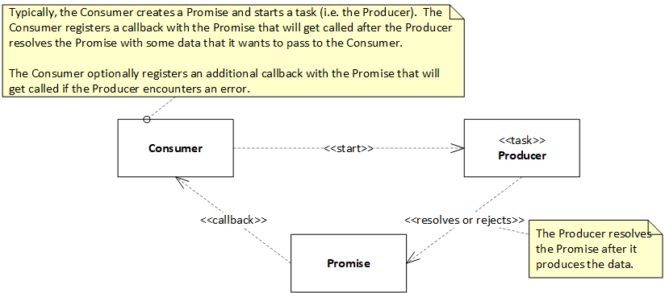
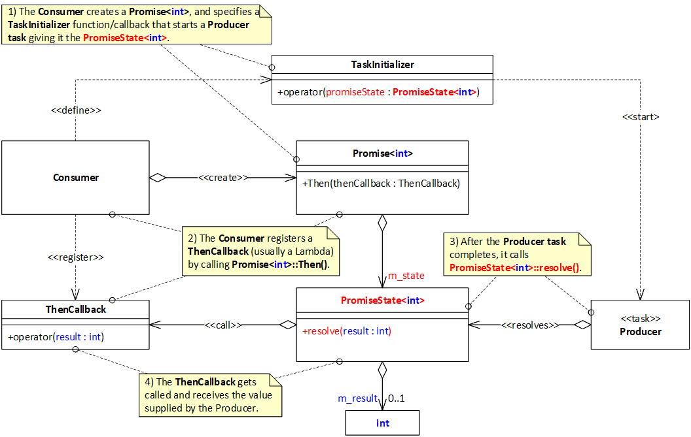
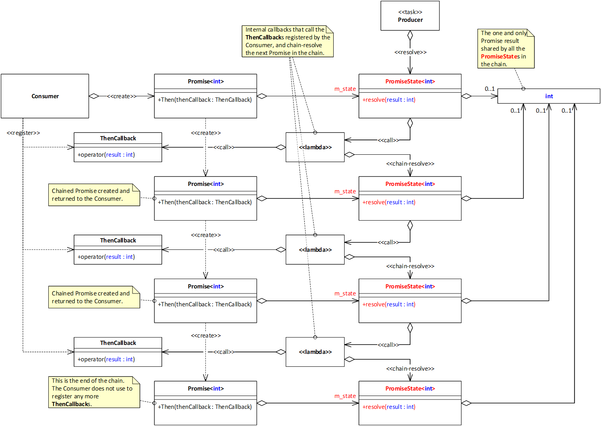
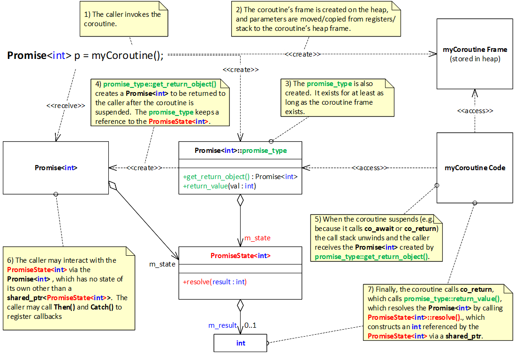
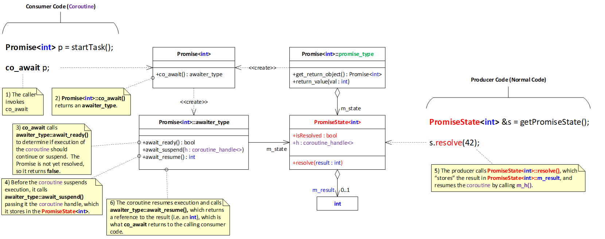

# JavaScript-like Promises for C++20

A [JavaScript Promise](https://developer.mozilla.org/en-US/docs/Web/JavaScript/Reference/Global_Objects/Promise) is an object that represents the eventual completion (or failure) of an asynchronous operation and its resulting value.

JavaScript Promises and *async* functions introduced by ES6 (also known as ECMAScript-6) are arguably the best thing since the invention of threads.  JavaScript Promises help you to implement legible and maintainable single-threaded asynchronous logic (e.g. for network applications).  Such programs entirely avoid the pitfalls of concurrency, are performant, and are generally easier to read and debug.

This library, named "JS-like Promises" for brevity, enables you to write single-threaded asynchronous C+\+20 code that looks and feels like JavaScript ES6 code.  The semantics and syntax of JS-like Promises are "close enough" to those of JavaScript ES6 Promises (see the [examples](#examples) section below for side-by-side JavaScript and C++ code), and the clarity of any code that uses it is expected to be comparable.  But because C++ is compiled and can be optimized, the speed of the resulting executable is **awesome!**

Use this library to build a wrapper for your favorite asynchronous network IO library (e.g. ASIO) and you'll find that you can easily take your application to the next level (well beyond just a simple chat client/server or TCP proxy) because of its readability and maintainability.


## Terminology

Before diving into concepts, it is important to note that the term "promise" is one of the most overloaded terms in the domain of Software Engineering, I promise.  So if you are already familiar with another promise API, then please clear your mind of those concepts and start fresh.  For brevity, from here on, the term "Promise" is used to refer to JS-Like Promises (which are uncannily similar to ES6 JavaScript promises).  So there is ample documentation out there to complement what you read here.

## Building
This project requires Visual Studio 2022 of higher.  The free (Community) version should be fine. Just open the .SLN file and build.

Make sure the Node.js (and npm) are also installed.  The "docs" project relies on JavaScript code in the "mdautogen" directory to auto-generate portions of this file (readme.md) to help keep the documentation up to date with working code (e.g. unit tests and example code).

I will try to find the time to port this project to CMake and gtest to make it more cross-platform.  But if anyone is willing to do it sooner, then feel free to create a pull request.  Alternately, I could do it if you hire me, but I expect that the result will remain open and unencumbered legally.


## Concept & Details

### Promises as Single-Use Communication Channels

Think of a Promise as a communication channel between a Producer (usually an asynchronous operation a.k.a. task) and a Consumer.  The channel may be used exactly once by the Producer to send to the Consumer either:
* A notification that an event occurred (usually accompanied by a value a.k.a. the *result*).  This occurs when the Consumer *resolves* the Promise; or
* A notification of an exception (e.g. an error detected by the Producer) along with the exception object.  This occurs when the Producer *rejects* the Promise.



### Explicitly Resolving a Promise

The diagram below shows with finer granularity the collaboration sequence between the Consumer and the Producer via the ```Promise``` and the ```PromiseState```, which is the object that holds the state of the ```Promise```, including the result.

Note that a ```Promise``` is just "thin veneer" around the ```PromiseState```.  ```Promises``` can be copied, moved, and passed around with low overhead because there is only a ```shared_ptr``` to be copied/moved.  The ```Promise``` class defines the ```Then()``` and ```Catch()``` methods via which the Consumer may register callbacks to handle the resolution or rejection of the ```Promise```.   These callbacks are typically lambda expressions.

```PromiseState``` implements the ```resolve()``` and ```reject()``` methods that a Producer may call to resolve or reject the ```Promise```.

The following UML class diagram is annotated with comments intended to illustrate the collaboration sequence between the key classifiers.  Note that in C++, the UML aggregation relationship (i.e. the arrow with the open diamond tail) is typically implemented as a ```shared_ptr```.  Thus, the diagram can also help you to infer the lifecycles of some of the classifiers (e.g. the ```PromiseState``` and the ```ThenCallback```).  Lastly, in the interest of clarity, the diagram omits the ```CatchCallback```, which the Consumer may register via the ```Promise::Catch()``` method.



The following application-level C++ code realizes this collaboration.

<!-- BEGIN_MDAUTOGEN: code_table_body('Consumer', 'Producer', '../docs/consumer.hpp', '../docs/producer.hpp') -->
|Consumer|Producer|
|----|----|
|<pre>auto p = Promise\<int\>(\[this](auto promiseState) {<br>  // This is the TaskInitializer.<br>  startAsyncOperation(promiseState);<br>});<br><br>p.Then(\[](int &result) {<br>  // This is the ThenCallback.<br>  cout \<\< "result = " \<\< result \<\< "\n";<br>});<br><br>p.Catch(\[](exception_ptr ex) {<br>  // This is the CatchCallback.<br>  // Handle exception<br>});|<pre>void startAsyncOperation(shared_ptr\<PromiseState\<int\>\> promiseState) {<br><br>  // Start an async operation via an API named Deep Thought.<br>  deepThoughtAPI.cogitate(<br><br>    // Deep Thought calls this lambda after it finds the answer to<br>    // Life, the Universe, and Everything.<br>    \[promiseState](error_code errorCode, int theAnswer) {<br><br>      if(errorCode) {<br>        // Deep Thought detected an error.  Notify the Consumer.<br>        promiseState-\>reject(make_exception_ptr(system_error(errorCode)));<br>      } else {<br>        // Send the answer to the Consumer.<br>        promiseState-\>resolve(theAnswer);<br>      }<br><br>    });<br>}|
<!-- END_MDAUTOGEN -->

### Chaining Promises

The diagram in the previous section is a bit of an oversimplification.  But it gets the idea cross.  The actual class diagram and sequence are a bit more complex.  The additional complexity is needed to support ```Promise``` *chaining*, which this section aims to explain.

As seen in the previous section, the Consumer registers its callbacks by calling ```Promise::Then()``` and ```Promise::Catch()```.  Each of these methods returns a new ```Promise``` that may be used to register an additional set of callbacks, and so on.  Each new ```Promise``` is *chained* to the previous one, which means that after the previous ```Promise``` gets resolved/rejected, the ```Promise``` chained to it also gets resolved/rejected, and so on down the chain.

For the curious, the following UML class diagram illustrates aspects of the design that supports chaining.  Pay attention to the ```shared_ptr``` references (denoted as UML aggregation relationships i.e. the arrows with an open diamond tail).  From them, you can infer the lifecycles of important classifiers such as the ```PromiseStates```, the ```ThenCallbacks```, and most notably the ```Promise``` result, which is shared by all the chained ```Promises```.  This sharing enhances efficiency, and enables interoperation with certain result types that cannot be copied (e.g. ```asio::ip::tcp::socket```).




## Integration with Coroutines

So far, all of this may seem like a glorified callback mechanism, which arguably isn't too far from the truth.  But the true power of ```Promises``` becomes evident when they are used in conjunction with coroutines.  This libraries provides a convenient and programmer-friendly coroutine integration mechanism with intuitive semantics and clear syntax.

Coroutines are essentially functions that can be suspended before they finish execution (e.g. perhaps because they must ```co_await``` for some data that isn't yet available).  Coroutines can later be resumed (e.g. when the data becomes available).  Note that this is something that you could alternately do with multiple threads  (e.g. by spawning and joining threads).  Both approaches result in clear code because they help the developer to avoid "callback hell" or having to implement complex state machines.  However, as you probably already know, the inevitable nondeterminism associated with multithreaded applications render them:
- hard to develop and certify for correctness because they are prone to concurrency-related bugs
- hard to maintain due to the risk of introducing concurrency-related bugs
- hard to unit test (for behavior) because of the nondeterminism associated with concurrency

```Promises``` have semantics similar to spawn/join, but help you to avoid these problems entirely.  Applications that use ```Promises``` are typically single-threaded, asynchronous, and can multitask just like multithreaded applications.

### Coroutines Return Promises

When using this library, your coroutine can be declared to return a ```Promise```.  It does this at "first opportunity" after you call it.  I.e. It returns the ```Promise``` after the coroutine suspends execution either because it calls ```co_await``` and it determines that execution may not continue, or because it calls ```co_return``` and execution implicitly suspends.  After the coroutine suspends execution, the call stack is unwound and you get the ```Promise```.  Note that the ```Promise``` may still be *unsettled* (i.e. neither resolved, nor rejected).

### Coroutines can Resolve Promises

To resolve the ```Promise``` returned by the coroutine, call ```co_return``` with the value with which you want to resolve the ```Promise```.  We will see in a subsequent section that ```co_return``` supports move semantics for efficiency, and to interoperate with result types such as ```asio::ip::tcp::socket``` that cannot be copied.

```
Promise<int> coroutine1() {
    co_return 1;                 // Resolve the Promise to 1 and returns it
}

int main() {
    auto y = coroutine1();       // y is assigned the reolved Promise
}
```

### Coroutines can Reject Promises

To implicitly reject the ```Promise``` returned by the coroutine, leave exceptions unhandled and they will "propagate" to the ```Promise```.  I.e. If an exception occurs, then the ```Promise``` will get rejected, and an ```exception_ptr``` to the exception will be saved in the ```PromiseState```.  Needless to say, throw an exception to explicitly reject the returned ```Promise```.

```
Promise<int> coroutine1() {
    int i = std::string().at(1);    // throw std::out_of_range
    co_return 1;                    // this statement is never reached
}

int main() {
    auto y = coroutine1();          // y is rejected because the coroutine threw an exception
}
```
### Coroutines can ```co_await``` Promises

By calling ```co_await``` and passing it a ```Promise```, your coroutine will receive an "awaiter" that collaborates with the ```PromiseState``` to:
* suspend the coroutine if the ```Promise``` is not yet resolved, and to resume it if/when the ```Promise``` gets resolved
    ```
    Promise<int> coroutine1() {
        co_return 1;                    // resolve the Promise returned by the coroutine
    }

    Promise<int> coroutine2() {
        int i = co_await coroutine1();  // resume if/when the Promise from coroutine1() is resolved
        co_return i;
    }

    int main() {
        auto y = coroutine2();          // y is resolved to 1
    }
    ```
* resume the coroutine and rethrow the exception with which the ```Promise``` was rejected, if/when the ```Promise``` gets rejected
    ```
    Promise<int> coroutine1() {
        int i = std::string().at(1);    // throw std::out_of_range
        co_return 1;                    // this statement is never reached
    }

    Promise<int> coroutine2() {
        int i = co_await coroutine1();  // The exception thrown by coroutine1() propagates here
        co_return 2;                    // this statement is never reached
    }

    int main() {
        auto y = coroutine2();          // y is rejected because coroutine2() did not handle the exception 
    }
    ```

### Coroutines can Chain Promises

If you would like the ```Promise``` returned by the coroutine to be chained to another ```Promise```, then call ```co_return``` with the other ```Promise```.  Consequently, if/when the other ```Promise``` gets resolved/rejected, then so will the ```Promise``` returned by the coroutine.
```
Promise<int> coroutine1() {
    Promise<int> x = taskThatReturnsAPromise();  // Call another function/coroutine that returns a Promise.
    // Note that x is different than the Promise returned by this coroutine.

    // This co_return doesn't actually return x.  It chains the Promise returned by this coroutine to x.  This means that:
    //   - If/when x gets resolved, then so will the Promise returned by this coroutine.
    //   - If/when x gets rejected, then so will the Promise returned by this coroutine.
    co_return x;
}

int main() {
    auto y = coroutine2();  // y is chained to x.
}
```


## Nitty-Gritty Details

### Calling Coroutines and Resolving Promises with co_return

Most C++ developers are familiar with calling regular routines (a.k.a. functions and methods).  E.g. They understand what happens during a call to a function with "by value" or "by reference" parameters.  However, understanding what happens during a call to a coroutines may require additional explanation.

Let's look at what happens when a caller invokes a coroutine that returns a ```Promise<int>```.  We'll also look at what happens when the coroutine resolves the ```Promise``` by calling ```co_return```.

The code and the diagram below are self-explanatory.

<!-- BEGIN_MDAUTOGEN: code_table_body('Caller', 'Coroutine', '../docs/anatomyOfCoroutineCall-caller.txt', '../docs/anatomyOfCoroutineCall-coroutine.txt') -->
|Caller|Coroutine|
|----|----|
|<pre>...<br><br>// See steps (1-5) in the diagram.<br>Promise\<int\> p = myCoroutine();<br><br>// See step (6) in the diagram.<br>p.Then(\[](int &result) {<br>  cout \<\< "promise was resolved with " \<\< result \<\< "\n";<br>});<br><br>...|<pre>Promise\<int\> myCoroutine() {<br>  // We'll cover what happens during co_await in a separate section<br>  co_await doSomethingElse();<br><br>  // See step (7) in the diagram.<br>  co_return 5;<br>}|
<!-- END_MDAUTOGEN -->



Note that the implementation may seem a bit confusing because ```promise_type``` is an inner class of ```Promise```, and from an idiomatic perspective, one would expect ```Promise``` to always create instances of its inner classes.  But that's not what happens.  In step (3) ```promise_type``` is automatically created when you call the coroutine.  In step (4) it creates an instance of its outer class ```Promise```, and returns it.  This is not a shortcoming of the implementation.  C++20 requires it.

### ```co_await```ing on a Promise

The following diagram explains what happens when a coroutine calls ```co_await``` on a ```Promise```.  The semantics of the call are:
- Suspend the coroutine execution if the ```Promise``` is not yet resolved.
- Resume execution if/when the ```Promise``` gets resolved.
- Throw if/when the ```Promise``` gets rejected (not shown in the diagram).

The diagram is well-commented and self-explanatory:



For enhanced clarity, note that the Producer side of the diagram is regular code (i.e. not a coroutine), which resolves the ```Promise``` explicitly by calling ```PromiseState<int>::resolve()```.  The diagram does not show the sequence that occurs when the ```Promise``` gets rejected.  Hopefully, the reader can easily infer that by looking at the code.

## Support for Move Semantics and Perfect Forwarding

If you call ```PromiseState<T>::resolve()``` with an rvalue reference, then it "tries to" move-construct the result (i.e. the value referenced by the ```PromiseState<T>``` via the ```shared_ptr<T>``` member named ```m_result```).  Otherwise, it copy-constructs the result.  Here are two examples that explicitly resolve a Promise (e.g. by calling ```PromiseState<T>::resolve()```:

* If you want to move-resolve a Promise, then use an rvalue reference like this:
    ```
    Promise<MoveConstructibleValueType> p([](auto promiseState) {
      MoveConstructibleValueType v;
      promiseState->resolve(move(v));  // Pass an rvalue reference to resolve().
    });
    ```
* Otherwise, if you are happy with copy-resolve, then use an lvalue reference:
    ```
    Promise<CopyConstructibleValueType> p([](auto promiseState) {
      CopyConstructibleValueType v;
      promiseState->resolve(v);  // No move() here.  Pass an lvalue reference to resolve().
    });
    ```
As a reminder, calling ```move()``` doesn't move anything.  It only casts an lvalue reference to an rvalue reference so that the appropriate variant of ```Promise<T>::resolve()``` gets called, which eventually calls your type's move-constructor.  So if you want performance, then implement [move constructors](https://docs.microsoft.com/en-us/cpp/cpp/move-constructors-and-move-assignment-operators-cpp) for the value types that you plan to use with Promises, and use ```move()``` to resolve Promises.

If you are curious, then take a look at the ```PromiseState<T>::resolve()``` methods in [JSLikePromise.hpp](./JSLikePromise.hpp) and use a debugger to step through code to see exactly what happens as a result of these calls.

Of course, the same concept applies when you implicitly resolve a Promise from inside a coroutine by using ```co_return```.  ```Promise<T>::promise_type``` defines a few variants of ```return_value()```, which the compiler calls depending on the type of reference used with ```co_return```.


### Resolve Examples

Now let's have a look at a few examples that put together the coroutine call sequence, and the resolve sequence.  As a challenge, try to predict/guess which constructors get called and how many times they gat called (without looking at the answers).

#### Example 1: Call Coroutine with "by value" Parameter and Resolve Promise

Consider the following code:
```
  Promise<TranscriptionCounter> coReturnFromValue(TranscriptionCounter val) {
    co_return val;
  }

  ...
  TranscriptionCounter obj;
  coReturnFromValue(obj);
  ...
```

How many times is the ```TranscriptionCounter``` copy constructor called?

How many times is the ```TranscriptionCounter``` move constructor alled?

**ANSWER**: Here is what happens (assuming unoptimized code):
1. The ```TranscriptionCounter``` copy constructor is called in order to make a stack-based call to ```coReturnFromValue(obj);```.
1. The ```TranscriptionCounter``` move constructor is called (if available) to move ```val``` from the stack to the coroutine's heap-based frame.  (Remember, the state of coroutines must live beyond the point when the stack is unwound because the coroutine is suspended.  So the compile creates a heap-based frame in which the state of the coroutine is maintained.)
1. The ```TranscriptionCounter``` move constructor is called (if available) because ```co_return``` invokes ```Promise<T>::promise_type::return_value(T &&val)```, which eventually resolves the Promise by moving ```val``` from the coroutine frame into the ```PromiseState```.

So the example above performs 1 copy and 2 moves.

#### Example 2: Call Coroutine with "by reference" Parameter and Resolve Promise

How about this example?
```
  Promise<TranscriptionCounter> coReturnFromReferenceByCopying(TranscriptionCounter &val) {
    co_return val;
  }

  ...
  TranscriptionCounter obj;
  coReturnFromReferenceByCopying(obj);
  ...
```

How many times is the ```TranscriptionCounter``` copy constructor called?

How many times is the ```TranscriptionCounter``` move constructor alled?

**ANSWER**: Here is what happens:
1. A reference to ```TranscriptionCounter``` is placed on the stack to make a stack-based call to ```coReturnFromReference(obj);```.
1. The reference to ```TranscriptionCounter``` is copied from the stack to the coroutine's heap-based frame so that the reference is available as parameter ```val``` to the coroutine's code.
1. The ```TranscriptionCounter``` copy constructor is called because ```co_return``` invokes ```Promise<T>::promise_type::return_value(const T &val)```, which eventually resolves the Promise by copying ```val```.

So the example above performs 1 copy.

#### Example 3: Call Coroutine with "by reference" Parameter and "Move" Resolve Promise

Finally, how about this example?
```
  Promise<TranscriptionCounter> coReturnFromReferenceByMoving(TranscriptionCounter &val) {
    co_return move(val);   // use move() to cast to an rvalue
  }

  ...
  TranscriptionCounter obj;
  coReturnFromReferenceByMoving(obj);
  ...
```

**ANSWER**: Here is what happens:
1. A reference to ```TranscriptionCounter``` is placed on the stack to make a stack-based call to ```coReturnFromReference(obj);```.
1. The reference to ```TranscriptionCounter``` is copied from the stack to the coroutine's heap-based frame so that the reference is available as parameter ```val``` to the coroutine's code.
1. The ```TranscriptionCounter``` move constructor is called because ```co_return``` invokes ```Promise<T>::promise_type::return_value(T &&val)```, which eventually resolves the Promise by moving ```val```.

So the example above performs 1 move.


### Consuming the Result from a Resolved Promise

After a Promise is resolved, your Consumer code can consume an lvalue reference to the result:
* via a callback (specified by calling ```Promise::Then()```)
    ```
    taskThatReturnsAnIntPromise().Then([](int &result) {
      cout << "result=" << result << "\n";
    });
    ```
* or by calling ```co_await``` from a coroutine.
    ```
    Promise<> coroutine1() {
      int &result(co_await taskThatReturnsAnIntPromise());
      cout << "result=" << result << "\n";
    }
    ```

### Result Lifecycle

As illustrated in the diagrams in the [Chaining Promises](#chaining-promises) and the [co_awaiting on a Promise](#co_awaiting-on-a-Promise) sections, ```PromiseState<T>``` maintains a ```shared_ptr<T>``` named ```m_result``` to the value with which the Promise was resolved (a.k.a. the result).  For efficiency, this ```shared_ptr``` is copied and passed along the chain of ```Promises```.  This design allows Promises to interoperate with value types that do not allow copying (e.g. ```asio::ip::tcp::socket```).  This suggests that the lifetime of the result is at least as long as the lifetime of the ```PromiseState<T>```, which is at least as long as ALL of the following:
- the lifetime of the heap-based frame of the coroutine that returned the ```Promise``` if it was created and returned by calling a coroutine
- the lifetime of the ```Promise``` and all of its copies (e.g. held by Consumer code) if the ```Promise``` was explicitly created by "regular" code
- some ```shared_ptr<PromiseState>```  references it (e.g. managed by Producer code)

So make sure that the code that receives the result (e.g. a "Then" lambda, or the code to the left of a ```co_await```) take proper custody of the result.  Otherwise, it may be prematurely destroyed along with the ```PromiseState<T>``` that references it.  To do this, there are several options.  Use the one that makes most sense:
* Move the result.
    ```
    Promise<> coroutineThatMovesTheResult() {
      // Get the lvalue reference.
      MovableType& result = co_await taskThatReturnsAMovableResultTypePromise();

      // Move the result into a new instance of MovableType.
      MovableType rr(move(result));  // cast result to an rvalue to invoke the move constructor

      cout << "rr=" << rr.internalValue() << "\n";
    }
    ```
* Copy the result.
    ```
    Promise<> coroutineThatCopiesTheResult() {
      // Get the lvalue reference.
      CopyableType& result = co_await taskThatReturnsACopyableResultTypePromise();

      // Copy the result to a new instance of CopyableType.
      CopyableType rr(result);  // use result as an lavalue to invoke the copy constructor

      cout << "rr=" << rr.internalValue() << "\n";
    }
    ```
* Get a ```shared_ptr``` to the result.  You will probably have to use ```enable_shared_from_this``` in your result type definition.
    ```
    Promise<> coroutineThatGetsASharedPointerToTheResult() {
      // Get the lvalue refrence.
      ShareableFromThisType& result = co_await taskThatReturnsAShareableResultTypePromise();

      // Get a shared_ptr to the result.
      shared_ptr<ShareableFromThisType> rr(result.shared_from_this());

      cout << "rr=" << rr->internalValue() << "\n";
    }
    ```

### Move Caveat

Needless to say, be careful to avoid moving a result twice.  For example, don't do this:
```
Promise<MovableType> p = taskThatReturnsAMovableResultTypePromise();
p.Then([](MovableType& result) {
    // This Lambda will be called first.

    MovableType rr(move(result));  // cast result to an rvalue to invoke the move constructor
    cout << "rr=" << rr.internalValue() << "\n";

  }).Then([](MovableType& result) {
    // This Lambda will be called next.

    MovableType rr(move(result));  // BUG: result was moved already
    cout << "rr=" << rr.internalValue() << "\n";
  });
```


## Header Files

Include these files in your <code>.cpp</code> files:

```
#include <iostream>  // for cout if you need it
#include <thread>    // for this_thread::sleep_for if you need it
using namespace std;

#include "JSLikeBasePromise.hpp"
#include "JSLikePromise.hpp"
#include "JSLikePromiseAny.hpp"
#include "JSLikePromiseAll.hpp"
using namespace JSLike;
```


## Examples

Here are a few side-by-side code examples that illustrate the capabilities of JS-like Promises and its remarkable syntactic and semantic similarity to JavaScript Promises.  As expected, the C++ code is slightly more verbose due to the language's requirement for type specificity.  So if you are familiar with JavaScipt Promises, then these examples should give you a running start with JS-like Promises.

### Ex 01: Return explicitly resolved Promise from a *regular function* and handle it with "Then"

<!-- BEGIN_MDAUTOGEN: code_table_body('JavaScript', 'C++20', '../Examples_JavaScript/example01.js', '../Examples_C++20/example01.hpp') -->
|JavaScript|C++20|
|----|----|
|<pre>function ex01_function() {<br>  return Promise.resolve(1);<br>}<br><br>function example01() {<br>  ex01_function().then((result) =\> {<br>    console.log("ex01\: result=" + result);<br>  });<br>}<br><br>example01();|<pre>Promise\<int\> ex01_function() {<br>  return Promise\<int\>\:\:resolve(1);<br>}<br><br>void example01() {<br>  ex01_function().Then(\[](int& result) {<br>    cout \<\< "ex01\: result=" \<\< result \<\< "\n";<br>  });<br>}<br><br>void main() { example01(); }<br>|
<!-- END_MDAUTOGEN -->

### Ex 02: Return initializer-resolved Promise from a *regular function* and handle it with "Then"

<!-- BEGIN_MDAUTOGEN: code_table_body('JavaScript', 'C++20', '../Examples_JavaScript/example02.js', '../Examples_C++20/example02.hpp') -->
|JavaScript|C++20|
|----|----|
|<pre>function ex02_function() {<br>    return new Promise((resolve, reject) =\> {<br>        resolve(2);<br>    });<br>}<br><br>function example02() {<br>  ex02_function().then((result) =\> {<br>    console.log("ex02\: result=" + result);<br>  });<br>}<br><br>example02();<br>|<pre>Promise\<int\> ex02_function() {<br>  return Promise\<int\>(\[](shared_ptr\<PromiseState\<int\>\> promiseState) {<br>    promiseState-\>resolve(2);<br>  });<br>}<br><br>void example02() {<br>  ex02_function().Then(\[](int& result) {<br>    cout \<\< "ex02\: result=" \<\< result \<\< "\n";<br>  });<br>}<br><br>void main() { example02(); }|
<!-- END_MDAUTOGEN -->

### Ex 02a: Return initializer-resolved Promise from a *coroutine* and handle it with "Then"

<!-- BEGIN_MDAUTOGEN: code_table_body('JavaScript', 'C++20', '../Examples_JavaScript/example02a.js', '../Examples_C++20/example02a.hpp') -->
|JavaScript|C++20|
|----|----|
|<pre>async function ex02a_function() {<br>    return new Promise((resolve, reject) =\> {<br>        resolve(2);<br>    });<br>}<br><br>function example02a() {<br>  ex02a_function().then((result) =\> {<br>    console.log("ex02\: result=" + result);<br>  });<br>}<br><br>example02a();<br>|<pre>Promise\<int\> ex02a_function() {<br>  co_return Promise\<int\>(\[](shared_ptr\<PromiseState\<int\>\> promiseState) {<br>    promiseState-\>resolve(2);<br>  });<br>}<br><br>void example02a() {<br>  ex02a_function().Then(\[](int &result) {<br>    cout \<\< "ex02a\: result=" \<\< result \<\< "\n";<br>  });<br>}<br><br>void main() { example02a(); }|
<!-- END_MDAUTOGEN -->

### Ex 03: Return implicitly-resolved Promise from a *coroutine* and handle it with "Then"

<!-- BEGIN_MDAUTOGEN: code_table_body('JavaScript', 'C++20', '../Examples_JavaScript/example03.js', '../Examples_C++20/example03.hpp') -->
|JavaScript|C++20|
|----|----|
|<pre>async function ex03_async() {<br>  return 3;<br>}<br><br>function example03() {<br>  ex03_async().then((result) =\> {<br>      console.log("ex03\: result=" + result);<br>  });<br>}<br><br>example03();|<pre>Promise\<int\> ex03_coroutine() {<br>  co_return 3;<br>}<br><br>void example03() {<br>  ex03_coroutine().Then(\[](int& result) {<br>    cout \<\< "ex03\: result=" \<\< result \<\< "\n";<br>  });<br>}<br><br>void main() { example03(); }|
<!-- END_MDAUTOGEN -->

### Ex 04: *co_await* a Promise returned by a *regular function*

<!-- BEGIN_MDAUTOGEN: code_table_body('JavaScript', 'C++20', '../Examples_JavaScript/example04.js', '../Examples_C++20/example04.hpp') -->
|JavaScript|C++20|
|----|----|
|<pre>let example04_resolve;<br><br>function ex04_resolveAfter1Sec() {<br>  return new Promise((resolve) =\> {<br>    example04_resolve = resolve;<br>  });<br>}<br><br>async function ex04_coroutine() {<br>  let result = await ex04_resolveAfter1Sec();<br>  return result;<br>}<br><br>function example04() {<br>  ex04_coroutine().then((result) =\> {<br>    console.log("ex04\: result after 1sec=" + result);<br>  });<br><br>  // Wait 1sec before resolving the Promise to the value 4.<br>  setTimeout(example04_resolve, 1000, 4);<br>}<br><br>example04();|<pre>shared_ptr\<PromiseState\<int\>\> example04_promiseState;<br><br>Promise\<int\> ex04_resolveAfter1Sec() {<br>  return Promise\<int\>(\[](shared_ptr\<PromiseState\<int\>\> promiseState) {<br>    example04_promiseState = promiseState;<br>  });<br>}<br><br>Promise\<int\> ex04_coroutine() {<br>  int result = co_await ex04_resolveAfter1Sec();<br>  co_return result;<br>}<br><br>void example04() {<br>  ex04_coroutine().Then(\[](int& result) {<br>    cout \<\< "ex04\: result after 1sec=" \<\< result \<\< "\n";<br>  });<br><br>  // Wait 1sec before resolving the Promise to the value 4.<br>  this_thread\:\:sleep_for(1000ms);<br>  example04_promiseState-\>resolve(4);<br>}<br><br>void main() { example04(); }|
<!-- END_MDAUTOGEN -->

### Ex 05: *co_await* a Promise returned by a *coroutine* that *co_await*s a Promise returned by a *regular function*

<!-- BEGIN_MDAUTOGEN: code_table_body('JavaScript', 'C++20', '../Examples_JavaScript/example05.js', '../Examples_C++20/example05.hpp') -->
|JavaScript|C++20|
|----|----|
|<pre>let example05_resolve;<br><br>function ex5_resolveAfter1Sec() {<br>  return new Promise((resolve) =\> {<br>    example05_resolve = resolve;<br>  });<br>}<br><br>async function ex5_coroutine1() {<br>  let result = await ex5_resolveAfter1Sec();<br>  return result;<br>}<br><br>async function ex5_coroutine2() {<br>  let result = await ex5_coroutine1();<br>  return result;<br>}<br><br>function example05() {<br>  ex5_coroutine2().then((result) =\> {<br>    console.log("ex05\: result after 1sec=" + result);<br>  });<br><br>  // Wait 1sec before resolving the Promise to the value 5.<br>  setTimeout(example05_resolve, 1000, 5);<br>}<br><br>example05();|<pre>shared_ptr\<PromiseState\<int\>\> example05_promiseState;<br><br>Promise\<int\> ex5_resolveAfter1Sec() {<br>  return Promise\<int\>(\[](shared_ptr\<PromiseState\<int\>\> promiseState) {<br>    example05_promiseState = promiseState;<br>  });<br>}<br><br>Promise\<int\> ex5_coroutine1() {<br>  int result = co_await ex5_resolveAfter1Sec();<br>  co_return result;<br>}<br><br>Promise\<int\> ex5_coroutine2() {<br>  int result = co_await ex5_coroutine1();<br>  co_return result;<br>}<br><br>void example05() {<br>  ex5_coroutine2().Then(\[](int& result) {<br>    cout \<\< "ex05\: result after 1sec=" \<\< result \<\< "\n";<br>  });<br><br>  // Wait 1sec before resolving the Promise to the value 5.<br>  this_thread\:\:sleep_for(1000ms);<br>  example05_promiseState-\>resolve(5);<br>}<br><br>void main() { example05(); }|
<!-- END_MDAUTOGEN -->

### Ex 06: PromiseAll resolved after 1sec and handled with "Then"

<!-- BEGIN_MDAUTOGEN: code_table_body('JavaScript', 'C++20', '../Examples_JavaScript/example06.js', '../Examples_C++20/example06.hpp') -->
|JavaScript|C++20|
|----|----|
|<pre>let example06_resolvers = \[];<br><br>function ex6_resolveAfter1Sec() {<br>  return new Promise((resolve) =\> {<br>    example06_resolvers.push(resolve);<br>  });<br>}<br><br>function example06() {<br>  let p0 = ex6_resolveAfter1Sec();<br>  let p1 = ex6_resolveAfter1Sec();<br>  let p2 = ex6_resolveAfter1Sec();<br><br>  let ex6_promiseAll = Promise.all(\[p0, p1, p2]).then((results) =\> {<br>    console.log("ex06\: result0 after 1sec=" + results\[0]);<br>    console.log("ex06\: result1 after 1sec=" + results\[1]);<br>    console.log("ex06\: result2 after 1sec=" + results\[2]);<br>  });<br><br>  // Wait 1sec before resolving all 3 Promises.<br>  setTimeout(example06_resolvers\[0], 1000, 6);<br>  setTimeout(example06_resolvers\[1], 1000, "six");<br>  setTimeout(example06_resolvers\[2], 1000, 6.6);<br>}<br><br>example06();|<pre>vector\<shared_ptr\<BasePromiseState\>\> example06_promiseStates;<br><br>template\<typename T\><br>Promise\<T\> ex6_resolveAfter1Sec() {<br>  return Promise\<T\>(\[](shared_ptr\<PromiseState\<T\>\> promiseState) {<br>    example06_promiseStates.push_back(promiseState);<br>  });<br>}<br><br>void example06() {<br>  auto p0 = ex6_resolveAfter1Sec\<int\>();<br>  auto p1 = ex6_resolveAfter1Sec\<string\>();<br>  auto p2 = ex6_resolveAfter1Sec\<double\>();<br><br>  PromiseAll ex6_promiseAll({ p0, p1, p2 });  ex6_promiseAll.Then(\[&](auto results) {<br>    cout \<\< "ex06\: result0 after 1sec=" \<\< results\[0]-\>value\<int\>() \<\< "\n";<br>    cout \<\< "ex06\: result1 after 1sec=" \<\< results\[1]-\>value\<string\>() \<\< "\n";<br>    cout \<\< "ex06\: result2 after 1sec=" \<\< results\[2]-\>value\<double\>() \<\< "\n";<br>  });<br><br>  // Wait 1sec before resolving all 3 Promises.<br>  std\:\:this_thread\:\:sleep_for(1000ms);<br>  example06_promiseStates\[0]-\>resolve\<int\>(6);<br>  example06_promiseStates\[1]-\>resolve\<string\>("six");<br>  example06_promiseStates\[2]-\>resolve\<double\>(6.6);<br>}<br><br>void main() { example06(); }|
<!-- END_MDAUTOGEN -->

### Ex 07: PromiseAny resolved after 1sec and handled with "Then"

<!-- BEGIN_MDAUTOGEN: code_table_body('JavaScript', 'C++20', '../Examples_JavaScript/example07.js', '../Examples_C++20/example07.hpp') -->
|JavaScript|C++20|
|----|----|
|<pre>let example07_resolvers = \[];<br><br>function ex7_resolveAfter1Sec() {<br>  return new Promise((resolve) =\> {<br>    example07_resolvers.push(resolve);<br>  });<br>}<br><br>function example07() {<br>  let p0 = ex7_resolveAfter1Sec();<br>  let p1 = ex7_resolveAfter1Sec();<br>  let p2 = ex7_resolveAfter1Sec();<br><br>  let ex7_promiseAny = Promise.any(\[p0, p1, p2]).then((result) =\> {<br>    // Note that we don't know which Promise was resolved.<br>    // Therefore, properly handling the result is not trivial.<br>    console.log("ex07\: result after 1sec=" + result);<br>  });<br><br>  // Wait 1sec before resolving just one of the 3 Promise.<br>  setTimeout(example07_resolvers\[1], 1000, "seven");<br>}<br><br>example07();|<pre>vector\<shared_ptr\<BasePromiseState\>\> example07_promiseStates;<br><br>template\<typename T\><br>Promise\<T\> ex7_resolveAfter1Sec() {<br>  return Promise\<T\>(\[](shared_ptr\<PromiseState\<T\>\> promiseState) {<br>    example07_promiseStates.push_back(promiseState);<br>  });<br>}<br><br>void example07() {<br>  auto p0 = ex7_resolveAfter1Sec\<int\>();<br>  auto p1 = ex7_resolveAfter1Sec\<string\>();<br>  auto p2 = ex7_resolveAfter1Sec\<double\>();<br><br>  PromiseAny ex7_promiseAny({ p0, p1, p2 }); ex7_promiseAny.Then(\[&](auto result) {<br>    if (result-\>isValueOfType\<int\>())    cout \<\< "ex07\: result0 after 1sec=" \<\< result-\>value\<int\>() \<\< "\n";<br>    else if (result-\>isValueOfType\<string\>()) cout \<\< "ex07\: result1 after 1sec=" \<\< result-\>value\<string\>() \<\< "\n";<br>    else                                      cout \<\< "ex07\: result2 after 1sec=" \<\< result-\>value\<double\>() \<\< "\n";<br>  });<br><br>  // Wait 1sec before resolving just one of the 3 Promise.<br>  std\:\:this_thread\:\:sleep_for(1000ms);<br>  example07_promiseStates\[1]-\>resolve\<string\>("seven");<br>}<br><br>void main() { example07(); }|
<!-- END_MDAUTOGEN -->

## Notable Differences

### Fixed Promise Value Type
Note that due to the C++ requirement for type specificity, valued Promises must be declared with a value type parameter:

```
Promise<int> p;
```

JavaScript does not impose this constraint.  In fact, you can resolve a JavaScript Promise to any value type.  However, one should hope that programs that rely on this flexibility are never allowed to reach production.  But each to his own...

### Coroutines can't ```co_return``` ```Promise<void>```

C\++20 coroutines can't return Promise<void> due to a [constraint](https://eel.is/c++draft/dcl.fct.def.coroutine#6) imposed by C++20 on coroutine promise types.  JavaScript async functions can.

Note that this constraint applies only to retruning ```Promise<void>```.  Returning valued Promises (e.g. ```Promise<int>```) is allowed.

<!-- BEGIN_MDAUTOGEN: code_table_body('JavaScript', 'C++20', '../Examples_JavaScript/difference01.js', '../Examples_C++20/difference01.hpp') -->
|JavaScript|C++20|
|----|----|
|<pre>async function difference01_function() {<br>  // JavaScript async functions can return Promises<br>  // that resolve to void.<br>  return new Promise(<br>    (resolve, reject) =\> {<br>      resolve();<br>    });<br>}<br><br><br>function difference01() {<br>  let p = difference01_function().then((result) =\> {<br>    console.log("dif01\: resolved");<br>  });<br>}<br><br>difference01();|<pre>Promise\<\> difference01_function() {<br>  // C++20 coroutines can't return Promise\<void\>.<br>  // The code below won't compile.<br>  //co_return Promise\<\>(<br>  //  \[](auto promiseState) {<br>  //    promiseState-\>resolve();<br>  //  });<br><br>  // You can do this instead\:<br>  co_return co_await Promise\<\>(<br>    \[](auto promiseState) {<br>      promiseState-\>resolve();<br>    });<br>}<br><br>void difference01() {<br>  Promise\<\> p = difference01_function(); p.Then(\[]() {<br>    cout \<\< "dif01\: resolved\n";<br>  });<br>}<br><br>void main() { difference01(); }|
<!-- END_MDAUTOGEN -->

### No Split Promise Chains

JavaScript Promises allow multiple calls to ```then()``` on the same Promise object.  This effectively lets you create a split/bifurcation in the chain of Promises becasue each call returns a new chained Promise on which you can call ```then()```, and so on...  In my experience this feature seems superfluous.  I never used it, and I probably never will.

JS-like Promises don't support this feature.  If you call ```Then()``` multiple times on the same Promise, then the last call wins, and the previous registered callbacks are lost.  This limitation can be easily remedied by enhancing [BasePromiseState](JSLikeBasePromise.hpp).  It could be done with only a minor hit to performance.  If you need this feature, then be my guest.


### Why "Then" instead of "then"?

Note that "Catch" operation is so name because "catch" is already taken as a C++ keywork.  "Then" is not.  But it would have been weird to capitalize one and not the other because they are such notable complementary operations.


## License

The source code for the site is licensed under the MIT license, which you can find in the MIT-LICENSE.txt file.
