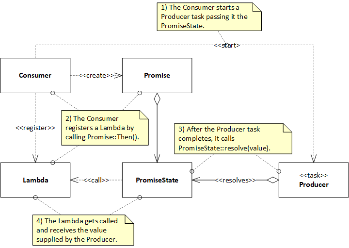

# JavaScript-like Promises for C++20

A [JavaScript Promise](https://developer.mozilla.org/en-US/docs/Web/JavaScript/Reference/Global_Objects/Promise) is an object that represents the eventual completion (or failure) of an asynchronous operation and its resulting value.

JavaScript Promises and *async* functions introduced by ES6 (also known as ECMAScript-6) are arguably the best thing since the invention of threads.  JavaScript Promises help you to implement legible and maintainable single-threaded asynchronous logic (e.g. for network applications).  Such programs entirely avoid the pitfalls of concurrency, are performant, and are generally easier to read and debug.

This library, named "JS-like Promises" for brevity, enables you to write single-threaded asynchronous C+\+20 code that looks and feels like JavaScript ES6 code.  The semantics and syntax of JS-like Promises are "close enough" to those of JavaScript ES6 Promises (see the [examples](#Examples) section below), and the clarity of any code that uses it is expected to be comparable.  But because C++ is compiled and can be optimized, the speed of the resulting executable is **awesome!**

Use this library to build a wrapper for your favorite asynchronous network IO library (e.g. ASIO) and you'll find that you can easily take your application to the next level (well beyond just a simple chat client/server or TCP proxy) because of its readability and maintainability.


## Terminology

Before diving into concepts, it is important to note that the term "promise" is one of the most overloaded terms in the domain of Software Engineering, I promise.  So if you are already familiar with another promise API, then please clear your mind of those concepts and start fresh.  For brevity, from here on, the term "Promise" is used to refer to JS-Like Promises (which are uncannily similar to ES6 JavaScript promises).  So there is ample documentation out there to complement what you read here.


## Overview & Concepts

### Promises as Single-Use Communication Channels

Think of a Promise as a communication channel between a Producer (usually an asynchronous operation a.k.a. task) and a Consumer.  The channel may be used exactly once by the Producer to send to the Consumer either:
* a notification that an event occurred (usually accompanied by a value); or
* a notification of an exception (e.g. an error detected by the Producer) along with the exception object


### Collaboration

The diagram below shows with finer granularity the collaboration sequence between the Consumer and the Producer via the Promise and the PromiseState, which is the object that holds the state of the Promise.  The state includes a shared_ptr to the value sent by the Producer to the Consumer, references to the callbacks, etc.

Note that a Promise is just "thin veneer" around the PromiseState.  Promises can be copied, moved, and passed around efficiently.  PromiseState implements the resolve() and reject() operations that a Producer typically calls.



The following pseudocode elucidates the collaboration logic.  Note that it also shows how to report and handle exceptions.

<!-- BEGIN_MDAUTOGEN: code_table_body('Consumer', 'Producer', '../docs/consumer.hpp', '../docs/producer.hpp') -->
|Consumer|Producer|
|----|----|
|<pre>auto p = Promise\<int\>(\[this](auto promiseState) {<br>  startAsyncOperation(promiseState);<br>});<br><br>p.Then(\[](int &result) {<br>  cout \<\< "result = " \<\< result \<\< "\n";<br>});<br><br>p.Catch(\[](exception_ptr ex) {<br>  // Handle exception<br>});|<pre>void startAsyncOperation(shared_ptr\<PromiseState\<int\>\> promiseState) {<br><br>  // Start an async operation via an API named Deep Thought.<br>  deepThoughtAPI.cogitate(<br><br>    // Deep Thought calls this Lambda after it finds the answer to<br>    // Life, the Universe, and Everything.<br>    \[promiseState](error_code errorCode, int theAnswer) {<br><br>      if(errorCode) {<br>        // Deep Thought detected an error.  Notify the Consumer.<br>        promiseState-\>reject(make_exception_ptr(system_error(errorCode)));<br>      } else {<br>        // Send the answer to the Consumer.<br>        promiseState-\>resolve(theAnswer);<br>      }<br><br>    });<br>}|
<!-- END_MDAUTOGEN -->

### Chaining Promises

As seen in the previous section, the Consumer registers its callbacks by calling Promise\::Then() and Promise\::Catch().  There is also a variant of Promise\::Then() that registers both callbacks at once.  Each of these operations returns a new Promise "chained" to the original one.  "Chained" means that after the Producer resolves or rejects the original Promise, the "chained" Promise also gets resolved/rejected.  The "chained" promise may be used to register another set of callbacks via Promise::Then() and Promise::Catch().

## Integration with Coroutines

So far, all of this may seem like a glorified callback mechanism, which arguably isn't too far from the truth.  But the true power of Promises becomes evident when they are used in conjunction with coroutines.

Coroutines are essentially functions that can be suspended in the middle of execution (e.g. perhaps because they need to ```co_await``` some data that isn't yet available), and that can be resumed later (e.g. perhaps when the data is finally available).  Because coroutines can return control to the caller before they finish execution, they typically return to the caller an object via which the coroutines can later publish the result of their execution so that the caller can retrieve it.

Promises fit naturally into this paradigm.  Specifically:
* If a coroutine ```co_awaits``` on a Promise, the Promise suspends the coroutine if the Promise isn't yet resolved.  Later, when the Promise is resolved, it resumes execution of the coroutine, and returns to the coroutine the value with which the Promise was resolved.
    ```
    Promise<> coroutine1() {
      Promise<int> x = taskThatReturnsAPromise();
      int value = co_await x;  // Suspend here if x is not resolved.  Resume after x is resolved.
      cout << "value=" << value << "\n";
    }
    ```
* Alternately, if the Promise is rejected, then the Promise rethrows the exception with which it was rejected in the context of the coroutine that ```co_await```s on it, and resumes the coroutine.
    ```
    Promise<> coroutine1() {
      Promise<int> x = taskThatReturnsAPromise();
      int value;
      try {
        value = co_await x;  // Resume and throw if x is rejected.
      } catch (exception &ex) {
        cout << "ex=" << ex.what() << "\n";
      }
      cout << "value=" << value << "\n";
    }
    ```
* Coroutines (typically) return to the caller an unresolved Promise (let's call it Y).
    - Y gets resolved if/when the coroutine ```co_return```s a value.
        ```
        Promise<int> coroutine1() {
          // The coroutine returns an unresolved Promise after it suspends execution.
          co_await doSomethingElse();  // suspend execution here

          co_return 1;                 // Resolve the returned Promise here.
        }

        int main() {
          auto y = coroutine1();       // y is returned before the coroutine finishes execution
        }
        ```
    - Y gets rejected if an exception is thrown and is left unhandled in the context of the coroutine.
        ```
        Promise<int> coroutine1() {
          int i = std::string().at(1);    // throw std::out_of_range
        }

        int main() {
          auto y = coroutine1();          // y is rejected
        }
        ```
    - If the coroutine ```co_return```s another Promise (lets call it X), then Y gets chained to X.  Thus, if X gets resolved, then so does Y.  Conversely, if X gets rejected, then so does Y.
        ```
        Promise<int> coroutine1() {
          // The coroutine returns an unresolved Promise after it suspends execution.
          co_await doSomethingElse();  // suspend execution here

          Promise<int> x = taskThatReturnsAPromise();  // Call another function that returns a Promise.
          // Note that x is different than the Promise returned by the coroutine.

          // This doesn't actually return x.  It chains the returned Promise to x so that if x gets
          // resolved, then so does the returned Promise.
          co_return x;
        }

        int main() {
          auto y = coroutine2();  // y is chained to x.
        }
        ```

This sort of collaboration with coroutines is powerful stuff.  You can code your application logic in a procedural way i.e. as a sequence of steps, even though some of the steps in the sequence may block/await for other tasks to complete.

It is also worth pointing out that C++20 coroutines are not meant for direct use by application code.  Rather, they are meant to be used through libraries/frameworks such as this one.  And JS-like Promises provides a convenient interface to them with well-documented and time-proven semantics.


## Nitty-Gritty Details

### Resolving Promises with Lvalue and Rvalue References

Valued Promises i.e. ```Promise<T>``` can be constructed/resolved from rvalue or lvalue references.  Internally, ```PromiseState<T>``` maintains a ```shared_ptr<T>``` to the resolved value.  If an rvalue reference is specified, then move/forward semantics are used (if the value type defines a move constructor).  Otherwise, the value is copied.  Here are two examples:

* If you want to move-resolve a Promise, then do something like this:
    ```
    Promise<MoveConstructibleValueType> p([](auto promiseState) {
      MoveConstructibleValueType v;
      promiseState->resolve(move(v));  // Pass an rvalue reference to resolve().
    });
    ```
* Otherwise, if you are happy with copy-resolve, then do something like this:
    ```
    Promise<CopyConstructibleValueType> p([](auto promiseState) {
      CopyConstructibleValueType v;
      promiseState->resolve(v);  // No move() here.  Pass an lvalue reference to resolve().
    });
    ```
As a reminder, calling ```move()``` doesn't move anything.  It only casts an lvalue reference to an rvalue reference so that the appropriate variant of ```Promise<T>::resolve()``` gets called, which eventually calls the move constructor if it is defined.  Otherwise, it calls the copy constructor as a fallback.   So if you want performance, then implement [move constructors](https://docs.microsoft.com/en-us/cpp/cpp/move-constructors-and-move-assignment-operators-cpp) for the value types that you plan to use with Promises, and use ```move()``` to resolve Promises.

For enhanced clarity, take a look at the implementation of the ```Promise<T>``` constructors and of the ```PromiseState<T>::resolve()``` variants in [JSLikePromise.hpp](./JSLikePromise.hpp) to see exactly what happens when you construct or resolve a Promise.


### Obtaining the Resolved Value from a Promise

After a Promise is resolved, your code can obtain an lvalue reference to the resolved value:
* via a callback (specified by calling ```Promise::Then()```)
    ```
    taskThatReturnsAnIntPromise().Then([](int &v) {
      cout << "v=" << v << "\n";
    });
    ```
* or by calling ```co_await``` from a coroutine.
    ```
    Promise<> coroutine1() {
      int &v(co_await taskThatReturnsAnIntPromise());
      cout << "v=" << v << "\n";
    }
    ```

### Resolved Value Lifecycle

```PromiseState<T>``` maintains a ```shared_ptr<T>``` to the value with which the Promise was resolved.  This ```shared_ptr``` is copied and passed along the chain of Promises.  This design is  more efficient (for types other than PODs), and it interoperates with types that do not allow copying (e.g. asio\::ip\::tcp\::socket).

This suggests that care must be taken because the resolved value may be destroyed when the ```PromiseState``` is destroyed (if the reference count to the value drops to 0).  Therefore, if you want the value to live beyond the ```PromiseState```, then you have a few options.  Use the one that makes most sense:
* Move the value.
    ```
    Promise<> coroutineThatMovesTheValue() {
      // Get the lvalue reference.
      MovableType& v = co_await taskThatReturnsAMovableValueTypePromise();

      // Move the resolved value into a new instance of MovableType.
      MovableType vv(move(v));  // cast v to an rvalue to invoke the move constructor

      cout << "vv=" << vv.internalValue() << "\n";
    }
    ```
* Copy the value.
    ```
    Promise<> coroutineThatCopiesTheValue() {
      // Get the lvalue reference.
      CopyableType& v = co_await taskThatReturnsACopyableValueTypePromise();

      // Copy the resolved value to a new instance of CopyableType.
      CopyableType vv(v);  // use v as an lavalue to invoke the copy constructor

      cout << "vv=" << vv.internalValue() << "\n";
    }
    ```
* Get a ```shared_ptr``` to the value.  You will probably have to use ```enable_shared_from_this``` in your value type definition.
    ```
    Promise<> coroutineThatGetsASharedPointerToTheValue() {
      // Copy the lvalue refrence to the resolved value.
      ShareableFromThisType& v = co_await taskThatReturnsAShareableValueTypePromise();

      // Get a shared_ptr to the resolved value.
      shared_ptr<ShareableFromThisType> vv(v.shared_from_this());

      cout << "vv=" << vv->internalValue() << "\n";
    }
    ```

### Move Caveat

Needless to say, be careful to not move a resolved value twice.  For example, don't do this:
```
Promise<MovableType> p = taskThatReturnsAMovableValueTypePromise();
p.Then([](MovableType& v) {
    // This Lambda will be called first.

    MovableType vv(move(v));  // cast v to an rvalue to invoke the move constructor
    cout << "vv=" << vv.internalValue() << "\n";

  }).Then([](MovableType& v) {
    // This Lambda will be called next.

    MovableType vv(move(v));  // BUG: v was moved already
    cout << "vv=" << vv.internalValue() << "\n";
  });
```


## Header Files

Include these files in your <code>.cpp</code> files:

```
#include <iostream>  // for cout if you need it
#include <thread>    // for this_thread::sleep_for if you need it
using namespace std;

#include "JSLikeBasePromise.hpp"
#include "JSLikePromise.hpp"
#include "JSLikePromiseAny.hpp"
#include "JSLikePromiseAll.hpp"
using namespace JSLike;
```


## Examples

Here are a few side-by-side code examples that illustrate the capabilities of JS-like Promises and its remarkable syntactic and semantic similarity to JavaScript Promises.  As expected, the C++ code is slightly more verbose due to the language's requirement for type specificity.  So if you are familiar with JavaScipt Promises, then these examples should give you a running start with JS-like Promises.

### Ex 01: Return explicitly resolved Promise from a *regular function* and handle it with "Then"

<!-- BEGIN_MDAUTOGEN: code_table_body('JavaScript', 'C++20', '../Examples_JavaScript/example01.js', '../Examples_C++20/example01.hpp') -->
|JavaScript|C++20|
|----|----|
|<pre>function ex01_function() {<br>  return Promise.resolve(1);<br>}<br><br>function example01() {<br>  ex01_function().then((result) =\> {<br>    console.log("ex01\: result=" + result);<br>  });<br>}<br><br>example01();|<pre>Promise\<int\> ex01_function() {<br>  return Promise\<int\>\:\:resolve(1);<br>}<br><br>void example01() {<br>  ex01_function().Then(\[](int& result) {<br>    cout \<\< "ex01\: result=" \<\< result \<\< "\n";<br>  });<br>}<br><br>void main() { example01(); }<br>|
<!-- END_MDAUTOGEN -->

### Ex 02: Return initializer-resolved Promise from a *regular function* and handle it with "Then"

<!-- BEGIN_MDAUTOGEN: code_table_body('JavaScript', 'C++20', '../Examples_JavaScript/example02.js', '../Examples_C++20/example02.hpp') -->
|JavaScript|C++20|
|----|----|
|<pre>function ex02_function() {<br>    return new Promise((resolve, reject) =\> {<br>        resolve(2);<br>    });<br>}<br><br>function example02() {<br>  ex02_function().then((result) =\> {<br>    console.log("ex02\: result=" + result);<br>  });<br>}<br><br>example02();<br>|<pre>Promise\<int\> ex02_function() {<br>  return Promise\<int\>(\[](shared_ptr\<PromiseState\<int\>\> promiseState) {<br>    promiseState-\>resolve(2);<br>  });<br>}<br><br>void example02() {<br>  ex02_function().Then(\[](int& result) {<br>    cout \<\< "ex02\: result=" \<\< result \<\< "\n";<br>  });<br>}<br><br>void main() { example02(); }|
<!-- END_MDAUTOGEN -->

### Ex 02a: Return initializer-resolved Promise from a *coroutine* and handle it with "Then"

<!-- BEGIN_MDAUTOGEN: code_table_body('JavaScript', 'C++20', '../Examples_JavaScript/example02a.js', '../Examples_C++20/example02a.hpp') -->
|JavaScript|C++20|
|----|----|
|<pre>async function ex02a_function() {<br>    return new Promise((resolve, reject) =\> {<br>        resolve(2);<br>    });<br>}<br><br>function example02a() {<br>  ex02a_function().then((result) =\> {<br>    console.log("ex02\: result=" + result);<br>  });<br>}<br><br>example02a();<br>|<pre>Promise\<int\> ex02a_function() {<br>  co_return Promise\<int\>(\[](shared_ptr\<PromiseState\<int\>\> promiseState) {<br>    promiseState-\>resolve(2);<br>  });<br>}<br><br>void example02a() {<br>  ex02a_function().Then(\[](int &result) {<br>    cout \<\< "ex02a\: result=" \<\< result \<\< "\n";<br>  });<br>}<br><br>void main() { example02a(); }|
<!-- END_MDAUTOGEN -->

### Ex 03: Return implicitly-resolved Promise from a *coroutine* and handle it with "Then"

<!-- BEGIN_MDAUTOGEN: code_table_body('JavaScript', 'C++20', '../Examples_JavaScript/example03.js', '../Examples_C++20/example03.hpp') -->
|JavaScript|C++20|
|----|----|
|<pre>async function ex03_async() {<br>  return 3;<br>}<br><br>function example03() {<br>  ex03_async().then((result) =\> {<br>      console.log("ex03\: result=" + result);<br>  });<br>}<br><br>example03();|<pre>Promise\<int\> ex03_coroutine() {<br>  co_return 3;<br>}<br><br>void example03() {<br>  ex03_coroutine().Then(\[](int& result) {<br>    cout \<\< "ex03\: result=" \<\< result \<\< "\n";<br>  });<br>}<br><br>void main() { example03(); }|
<!-- END_MDAUTOGEN -->

### Ex 04: *co_await* a Promise returned by a *regular function*

<!-- BEGIN_MDAUTOGEN: code_table_body('JavaScript', 'C++20', '../Examples_JavaScript/example04.js', '../Examples_C++20/example04.hpp') -->
|JavaScript|C++20|
|----|----|
|<pre>let example04_resolve;<br><br>function ex04_resolveAfter1Sec() {<br>  return new Promise((resolve) =\> {<br>    example04_resolve = resolve;<br>  });<br>}<br><br>async function ex04_coroutine() {<br>  let result = await ex04_resolveAfter1Sec();<br>  return result;<br>}<br><br>function example04() {<br>  ex04_coroutine().then((result) =\> {<br>    console.log("ex04\: result after 1sec=" + result);<br>  });<br><br>  // Wait 1sec before resolving the Promise to the value 4.<br>  setTimeout(example04_resolve, 1000, 4);<br>}<br><br>example04();|<pre>shared_ptr\<PromiseState\<int\>\> example04_promiseState;<br><br>Promise\<int\> ex04_resolveAfter1Sec() {<br>  return Promise\<int\>(\[](shared_ptr\<PromiseState\<int\>\> promiseState) {<br>    example04_promiseState = promiseState;<br>  });<br>}<br><br>Promise\<int\> ex04_coroutine() {<br>  int result = co_await ex04_resolveAfter1Sec();<br>  co_return result;<br>}<br><br>void example04() {<br>  ex04_coroutine().Then(\[](int& result) {<br>    cout \<\< "ex04\: result after 1sec=" \<\< result \<\< "\n";<br>  });<br><br>  // Wait 1sec before resolving the Promise to the value 4.<br>  this_thread\:\:sleep_for(1000ms);<br>  example04_promiseState-\>resolve(4);<br>}<br><br>void main() { example04(); }|
<!-- END_MDAUTOGEN -->

### Ex 05: *co_await* a Promise returned by a *coroutine* that *co_await*s a Promise returned by a *regular function*

<!-- BEGIN_MDAUTOGEN: code_table_body('JavaScript', 'C++20', '../Examples_JavaScript/example05.js', '../Examples_C++20/example05.hpp') -->
|JavaScript|C++20|
|----|----|
|<pre>let example05_resolve;<br><br>function ex5_resolveAfter1Sec() {<br>  return new Promise((resolve) =\> {<br>    example05_resolve = resolve;<br>  });<br>}<br><br>async function ex5_coroutine1() {<br>  let result = await ex5_resolveAfter1Sec();<br>  return result;<br>}<br><br>async function ex5_coroutine2() {<br>  let result = await ex5_coroutine1();<br>  return result;<br>}<br><br>function example05() {<br>  ex5_coroutine2().then((result) =\> {<br>    console.log("ex05\: result after 1sec=" + result);<br>  });<br><br>  // Wait 1sec before resolving the Promise to the value 5.<br>  setTimeout(example05_resolve, 1000, 5);<br>}<br><br>example05();|<pre>shared_ptr\<PromiseState\<int\>\> example05_promiseState;<br><br>Promise\<int\> ex5_resolveAfter1Sec() {<br>  return Promise\<int\>(\[](shared_ptr\<PromiseState\<int\>\> promiseState) {<br>    example05_promiseState = promiseState;<br>  });<br>}<br><br>Promise\<int\> ex5_coroutine1() {<br>  int result = co_await ex5_resolveAfter1Sec();<br>  co_return result;<br>}<br><br>Promise\<int\> ex5_coroutine2() {<br>  int result = co_await ex5_coroutine1();<br>  co_return result;<br>}<br><br>void example05() {<br>  ex5_coroutine2().Then(\[](int& result) {<br>    cout \<\< "ex05\: result after 1sec=" \<\< result \<\< "\n";<br>  });<br><br>  // Wait 1sec before resolving the Promise to the value 5.<br>  this_thread\:\:sleep_for(1000ms);<br>  example05_promiseState-\>resolve(5);<br>}<br><br>void main() { example05(); }|
<!-- END_MDAUTOGEN -->

### Ex 06: PromiseAll resolved after 1sec and handled with "Then"

<!-- BEGIN_MDAUTOGEN: code_table_body('JavaScript', 'C++20', '../Examples_JavaScript/example06.js', '../Examples_C++20/example06.hpp') -->
|JavaScript|C++20|
|----|----|
|<pre>let example06_resolvers = \[];<br><br>function ex6_resolveAfter1Sec() {<br>  return new Promise((resolve) =\> {<br>    example06_resolvers.push(resolve);<br>  });<br>}<br><br>function example06() {<br>  let p0 = ex6_resolveAfter1Sec();<br>  let p1 = ex6_resolveAfter1Sec();<br>  let p2 = ex6_resolveAfter1Sec();<br><br>  let ex6_promiseAll = Promise.all(\[p0, p1, p2]).then((results) =\> {<br>    console.log("ex06\: result0 after 1sec=" + results\[0]);<br>    console.log("ex06\: result1 after 1sec=" + results\[1]);<br>    console.log("ex06\: result2 after 1sec=" + results\[2]);<br>  });<br><br>  // Wait 1sec before resolving all 3 Promises.<br>  setTimeout(example06_resolvers\[0], 1000, 6);<br>  setTimeout(example06_resolvers\[1], 1000, "six");<br>  setTimeout(example06_resolvers\[2], 1000, 6.6);<br>}<br><br>example06();|<pre>vector\<shared_ptr\<BasePromiseState\>\> example06_promiseStates;<br><br>template\<typename T\><br>Promise\<T\> ex6_resolveAfter1Sec() {<br>  return Promise\<T\>(\[](shared_ptr\<PromiseState\<T\>\> promiseState) {<br>    example06_promiseStates.push_back(promiseState);<br>  });<br>}<br><br>void example06() {<br>  auto p0 = ex6_resolveAfter1Sec\<int\>();<br>  auto p1 = ex6_resolveAfter1Sec\<string\>();<br>  auto p2 = ex6_resolveAfter1Sec\<double\>();<br><br>  PromiseAll ex6_promiseAll({ p0, p1, p2 });  ex6_promiseAll.Then(\[&](auto results) {<br>    cout \<\< "ex06\: result0 after 1sec=" \<\< results\[0]-\>value\<int\>() \<\< "\n";<br>    cout \<\< "ex06\: result1 after 1sec=" \<\< results\[1]-\>value\<string\>() \<\< "\n";<br>    cout \<\< "ex06\: result2 after 1sec=" \<\< results\[2]-\>value\<double\>() \<\< "\n";<br>  });<br><br>  // Wait 1sec before resolving all 3 Promises.<br>  std\:\:this_thread\:\:sleep_for(1000ms);<br>  example06_promiseStates\[0]-\>resolve\<int\>(6);<br>  example06_promiseStates\[1]-\>resolve\<string\>("six");<br>  example06_promiseStates\[2]-\>resolve\<double\>(6.6);<br>}<br><br>void main() { example06(); }|
<!-- END_MDAUTOGEN -->

### Ex 07: PromiseAny resolved after 1sec and handled with "Then"

<!-- BEGIN_MDAUTOGEN: code_table_body('JavaScript', 'C++20', '../Examples_JavaScript/example07.js', '../Examples_C++20/example07.hpp') -->
|JavaScript|C++20|
|----|----|
|<pre>let example07_resolvers = \[];<br><br>function ex7_resolveAfter1Sec() {<br>  return new Promise((resolve) =\> {<br>    example07_resolvers.push(resolve);<br>  });<br>}<br><br>function example07() {<br>  let p0 = ex7_resolveAfter1Sec();<br>  let p1 = ex7_resolveAfter1Sec();<br>  let p2 = ex7_resolveAfter1Sec();<br><br>  let ex7_promiseAny = Promise.any(\[p0, p1, p2]).then((result) =\> {<br>    // Note that we don't know which Promise was resolved.<br>    // Therefore, properly handling the result is not trivial.<br>    console.log("ex07\: result after 1sec=" + result);<br>  });<br><br>  // Wait 1sec before resolving just one of the 3 Promise.<br>  setTimeout(example07_resolvers\[1], 1000, "seven");<br>}<br><br>example07();|<pre>vector\<shared_ptr\<BasePromiseState\>\> example07_promiseStates;<br><br>template\<typename T\><br>Promise\<T\> ex7_resolveAfter1Sec() {<br>  return Promise\<T\>(\[](shared_ptr\<PromiseState\<T\>\> promiseState) {<br>    example07_promiseStates.push_back(promiseState);<br>  });<br>}<br><br>void example07() {<br>  auto p0 = ex7_resolveAfter1Sec\<int\>();<br>  auto p1 = ex7_resolveAfter1Sec\<string\>();<br>  auto p2 = ex7_resolveAfter1Sec\<double\>();<br><br>  PromiseAny ex7_promiseAny({ p0, p1, p2 }); ex7_promiseAny.Then(\[&](auto result) {<br>    if (result-\>isValueOfType\<int\>())    cout \<\< "ex07\: result0 after 1sec=" \<\< result-\>value\<int\>() \<\< "\n";<br>    else if (result-\>isValueOfType\<string\>()) cout \<\< "ex07\: result1 after 1sec=" \<\< result-\>value\<string\>() \<\< "\n";<br>    else                                      cout \<\< "ex07\: result2 after 1sec=" \<\< result-\>value\<double\>() \<\< "\n";<br>  });<br><br>  // Wait 1sec before resolving just one of the 3 Promise.<br>  std\:\:this_thread\:\:sleep_for(1000ms);<br>  example07_promiseStates\[1]-\>resolve\<string\>("seven");<br>}<br><br>void main() { example07(); }|
<!-- END_MDAUTOGEN -->

## Notable Differences

### Fixed Promise Value Type
Note that due to the C++ requirement for type specificity, valued Promises must be declared with a value type parameter:

```
Promise<int> p;
```

JavaScript does not impose this constraint.  In fact, you can resolve a JavaScript Promise to any value type.  However, one should hope that programs that rely on this flexibility are never allowed to reach production.  But each to his own...

### *coroutine*s can't co_return Promise\<void\>

C\++20 coroutines can't return Promise<void> due to a [constraint](https://eel.is/c++draft/dcl.fct.def.coroutine#6) imposed by C++20 on coroutine promise types.  JavaScript async functions can.

Note that this constraint applies only to retruning ```Promise<void>```.  Returning valued Promises (e.g. ```Promise<int>```) is allowed.

<!-- BEGIN_MDAUTOGEN: code_table_body('JavaScript', 'C++20', '../Examples_JavaScript/difference01.js', '../Examples_C++20/difference01.hpp') -->
|JavaScript|C++20|
|----|----|
|<pre>async function difference01_function() {<br>  // JavaScript async functions can return Promises<br>  // that resolve to void.<br>  return new Promise(<br>    (resolve, reject) =\> {<br>      resolve();<br>    });<br>}<br><br><br>function difference01() {<br>  let p = difference01_function().then((result) =\> {<br>    console.log("dif01\: resolved");<br>  });<br>}<br><br>difference01();|<pre>Promise\<\> difference01_function() {<br>  // C++20 coroutines can't return Promise\<void\>.<br>  // The code below won't compile.<br>  //co_return Promise\<\>(<br>  //  \[](auto promiseState) {<br>  //    promiseState-\>resolve();<br>  //  });<br><br>  // You can do this instead\:<br>  co_return co_await Promise\<\>(<br>    \[](auto promiseState) {<br>      promiseState-\>resolve();<br>    });<br>}<br><br>void difference01() {<br>  Promise\<\> p = difference01_function(); p.Then(\[]() {<br>    cout \<\< "dif01\: resolved\n";<br>  });<br>}<br><br>void main() { difference01(); }|
<!-- END_MDAUTOGEN -->

### No Split Promise Chains

JavaScript Promises allow multiple calls to ```then()``` on the same Promise object.  This effectively lets you create a split/bifurcation in the chain of Promises becasue each call returns a new chained Promise on which you can call ```then()```, and so on...  In my experience this feature seems superfluous.  I never used it, and I probably never will.

JS-like Promises don't support this feature.  If you call ```Then()``` multiple times on the same Promise, then the last call wins, and the previous registered callbacks are lost.  This limitation can be easily remedied by enhancing [BasePromiseState](JSLikeBasePromise.hpp).  It could be done with only a minor hit to performance.  If you need this feature, then be my guest.


### Why "Then" instead of "then"?

Note that "Catch" operation is so name because "catch" is already taken as a C++ keywork.  "Then" is not.  But it would have been weird to capitalize one and not the other because they are such notable complementary operations.


## License

The source code for the site is licensed under the MIT license, which you can find in the MIT-LICENSE.txt file.
